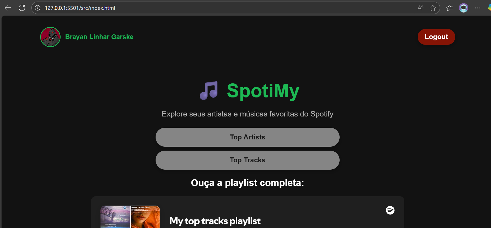
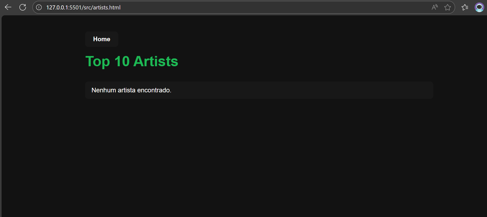
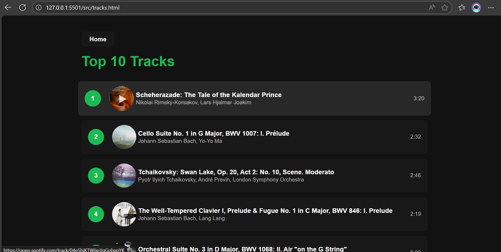

# 🎵 SpotiMy

Aplicação web que consome a API do Spotify para exibir os **Top Artistas** e **Top Músicas** do usuário autenticado.
O projeto foi construído em **JavaScript (ES Modules)**, usando autenticação **OAuth 2.0 com PKCE** e suporte a **refresh token** para manter a sessão ativa.

---

## 🚀 Funcionalidades

* 🔐 Login seguro via **OAuth 2.0 com PKCE**
* 👤 Exibição do **perfil do usuário** do Spotify (nome + avatar)
* 🎤 Página de **Top Artistas** (com gêneros e link para Spotify)
* 🎶 Página de **Top Músicas** (com preview player integrado)
* ♻️ **Refresh token automático** para prolongar sessão sem relogar
* 📱 Layout responsivo e simples

---

## 📂 Estrutura do Projeto

```
spotiMy/
├── .env                  # Variáveis de ambiente (Client ID, Secret, Redirect URI)
├── .gitignore            # Ignora node_modules e .env no Git
├── package.json
├── server.js             # Servidor Node.js (troca/refresh de tokens)
├── src/
│   ├── index.html        # Página inicial (Home)
│   ├── artists.html      # Página de Top Artistas
│   ├── tracks.html       # Página de Top Músicas
│   ├── css/
│   │   ├── style.css
│   │   └── style-home.css
│   ├── js/
│   │   ├── api.js        # Comunicação com Spotify API
│   │   ├── auth.js       # Fluxo de autenticação PKCE
│   │   ├── profile.js    # Renderização do perfil do usuário
│   │   ├── artists.js    # Lógica para listar artistas
│   │   ├── tracks.js     # Lógica para listar músicas
│   │   └── config.js     # Configurações do frontend (Client ID + Redirect URI)
│   └── assets/           # Imagens e placeholders
└── node_modules/
```

---

## ⚙️ Pré-requisitos

1. Criar uma aplicação no [Spotify Developer Dashboard](https://developer.spotify.com/dashboard/).
2. Configurar o **Redirect URI** para o seu ambiente local, por exemplo:

   ```
   http://127.0.0.1:5501/src/index.html
   ```
3. Ter **Node.js** instalado.
4. Criar o arquivo `.env` na raiz do projeto:

   ```env
   SPOTIFY_CLIENT_ID=seu_client_id
   SPOTIFY_CLIENT_SECRET=sua_secret
   REDIRECT_URI=http://127.0.0.1:5501/src/index.html
   ```

   ⚠️ Esse arquivo **não deve ser commitado**.
   Já está listado no `.gitignore`.

---

## ▶️ Como rodar

1. Clone este repositório:

   ```bash
   git clone https://github.com/BrayanDeve/SpotiMy.git
   cd spotimy
   ```

2. Instale as dependências (na raiz do projeto):

   ```bash
   npm install
   ```
   ```bash
   npm install express dotenv
   ```

3. Inicie o backend (servidor Node para refresh token):

   ```bash
   node server.js
   ```

   O servidor rodará em `http://localhost:3000`.

4. No **frontend**, configure `src/js/config.js` com o **Client ID** e o **Redirect URI**:

   ```js
   export const CLIENT_ID = "seu_client_id"; // mesmo do Spotify Dashboard
   export const REDIRECT_URI = "http://127.0.0.1:5501/src/index.html";
   export const SCOPES = "user-top-read user-read-private";
   ```

   > ⚠️ Apenas o **Client ID** vai no frontend.
   > O **Secret** fica seguro no `.env` e nunca deve ser exposto.

5. Abra o projeto no navegador usando o **Live Server** (porta configurada no `.vscode/settings.json`, padrão `5501`).

6. Clique em **Login**, autentique-se no Spotify e aproveite! 🎉

---

## 🖥️ Tecnologias Utilizadas

* **HTML5, CSS3, JavaScript (ES Modules)**
* **Spotify Web API**
* **OAuth 2.0 + PKCE**
* **Node.js + Express** (para refresh token)

---

## 📸 Screenshots

### Home



### Top Artists



### Top Tracks



---

## 📜 Licença

Este projeto é livre para uso e modificação.
